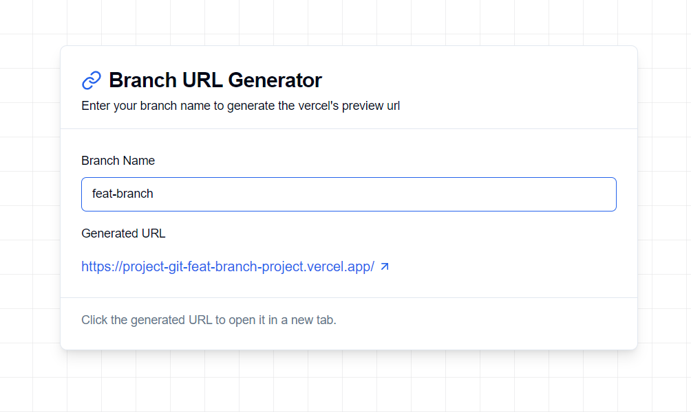

# 🔗 Vercel Branch URL Generator

A sleek, modern tool that instantly generates Vercel preview deployment URLs from branch names. Perfect for developers working with Vercel deployments who want to quickly access their preview environments without manual URL construction.

[](LICENSE)
[](https://nextjs.org/)
[](https://www.typescriptlang.org/)
[](https://tailwindcss.com/)

## 🌟 Overview

Vercel Branch URL Generator streamlines the development workflow by automatically converting Git branch names into their corresponding Vercel preview deployment URLs. With a beautiful, responsive interface and real-time URL generation, it's the perfect companion for teams using Vercel for their deployments.



## ✨ Features

- **⚡️ Instant URL Generation**: Real-time URL creation as you type
- **🎨 Modern UI/UX**: Clean, responsive interface with animated background
- **🔄 URL Sanitization**: Automatic conversion of branch names to URL-friendly format
- **💾 Persistent Settings**: Project names saved via URL parameters
- **🎯 One-Click Access**: Direct links to preview deployments
- **🌐 Multi-Project Support**: Customizable project name for different repositories

## 🚀 Quick Start

1. Visit [Website](https://vercel-preview-url-generator.vercel.app/)
2. (Optional) Set your project name if different from default
3. Enter your branch name (e.g., `feature/user-auth` or `feat-JIR-2147-edit-content`)
4. Click the generated URL to open your preview deployment

## 🛠️ Tech Stack

- **Framework**: Next.js 14
- **Language**: TypeScript
- **Styling**: Tailwind CSS
- **Components**: shadcn/ui
- **State Management**: nuqs for URL state
- **UI Icons**: Lucide Icons

## 💻 Development

```bash
# Clone the repository
git clone https://github.com/yourusername/vercel-branch-url-generator.git

# Navigate to the project
cd vercel-branch-url-generator

# Install dependencies
npm install

# Start development server
npm run dev
```

## 🤝 Contributing

Contributions are welcome! Please feel free to submit a Pull Request.

1. Fork the repository
2. Create your feature branch (`git checkout -b feature/amazing-feature`)
3. Commit your changes (`git commit -m 'Add some amazing feature'`)
4. Push to the branch (`git push origin feature/amazing-feature`)
5. Open a Pull Request

## 📝 License

This project is licensed under the MIT License - see the [LICENSE](LICENSE) file for details.

## 👤 Author

**Yonatan Lavy**

## ⭐️ Show your support

Give a ⭐️ if this project helped you!

---

Made with ❤️ by Yonatan Lavy
